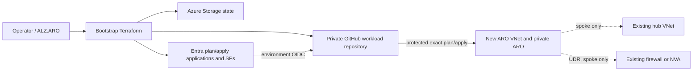

# Architecture

The bootstrap and workload states are separate. Bootstrap starts local and creates the remote backend used by workload Terraform. The two GitHub environments use separate user-assigned managed identities. No client credential is issued; federated subjects are `repo:<owner>/<repo>:environment:plan|apply`.

The workload configures `azurerm.workload` and `azurerm.connectivity` aliases. In standalone mode all hub-related resources have zero instances. In spoke mode the reverse peering is created through the connectivity alias while the hub itself is identified only by resource ID. The existing hub and next hop are absent from Terraform resources and therefore cannot be destroyed by this project.
