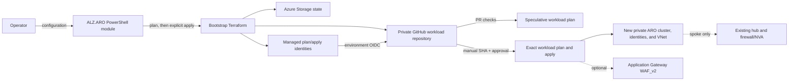

# How it works

aroapplz uses a local bootstrap stage to create a GitHub-hosted workload delivery stage. Their states, identities, and apply decisions remain separate.

## Stage 1: local bootstrap

`Deploy-AROLandingZone` reads or creates JSON configuration, validates the two-mode contract, performs preflight checks, and pins an exact ARO version returned for the configured region. It then gathers the workload templates and writes bootstrap Terraform input.

The command always creates a bootstrap plan. It applies that exact local plan only when `-BootstrapAction apply` is explicitly selected and confirmation succeeds (or `-AutoApprove` is deliberately used).

Bootstrap creates:

- hardened Azure Storage and a container for workload Terraform state;
- separate user-assigned managed identities for plan and apply;
- environment-scoped GitHub OIDC federated credentials;
- the implemented Azure role assignments;
- a private GitHub repository, protected environments, variables, files, and workflows.

The bootstrap state starts locally. It is not the same state as the generated workload.

## Stage 2: generated workload delivery

The generated private repository contains Terraform for the workload and four GitHub workflow files: the `01` CI caller, `02` CD caller, CI template, and CD template.

### Pull-request CI

CI checks formatting, initializes and validates Terraform, runs Checkov, and creates a speculative plan. A pull-request plan is evidence for review, not permission to deploy.

### Manual CD

CD is manually dispatched from the default branch with an `apply` or `destroy` action. It verifies the selected commit, creates a Terraform plan, and uploads the plan artifact. The protected `apply` environment then gates applying that exact artifact when the GitHub plan supports reviewers. The plan and apply identities are distinct.

### Guarded destroy through CD

Destroy is manual-only. Dispatch **02 ARO Landing Zone Continuous Delivery** from the default branch and select `destroy`. The CD template verifies the branch and selected commit, creates a destroy plan, and applies that exact artifact after protected-environment approval when supported.

!!! note "No automatic workload apply"
    Bootstrap apply creates the delivery platform and repository. It does not dispatch or apply workload Terraform.

## Terraform ownership boundaries

The workload owns its newly created resource group, ARO VNet, ARO subnets, cluster, and mode-dependent connection resources. In `spoke`, the existing hub VNet and firewall/NVA are referenced by ID/IP and remain outside workload ownership.

The workload uses separate `azurerm.workload` and `azurerm.connectivity` provider aliases. In `standalone`, hub-related resources have zero instances. In `spoke`, the connectivity alias creates the reverse peering in the existing hub's subscription without treating the hub itself as a managed resource.

## Ingress options

- `none` is the default;
- `front_door` is a follow-on integration contract;
- `application_gateway` provisions a public WAF_v2 gateway in a dedicated subnet, connects its backend to the private ARO ingress IP over HTTPS, and sends diagnostics to Log Analytics.

The ARO API and ingress profiles created by the workload are private.
