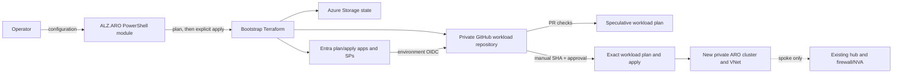

# How it works

aroapplz uses a local bootstrap stage to create a GitHub-hosted workload delivery stage. Their states, identities, and apply decisions remain separate.

## Stage 1: local bootstrap

`Deploy-AROLandingZone` reads or creates JSON configuration, validates the two-mode contract, performs preflight checks, and pins an exact ARO version returned for the configured region. It then gathers the workload templates and writes bootstrap Terraform input.

The command always creates a bootstrap plan. It applies that exact local plan only when `-BootstrapAction apply` is explicitly selected and confirmation succeeds (or `-AutoApprove` is deliberately used).

Bootstrap creates:

- hardened Azure Storage and a container for workload Terraform state;
- separate Microsoft Entra applications and service principals for plan and apply;
- environment-scoped GitHub OIDC federated credentials;
- the implemented Azure role assignments;
- a private GitHub repository, protected environments, variables, files, and workflows.

The bootstrap state starts locally. It is not the same state as the generated workload.

## Stage 2: generated workload delivery

The generated private repository contains Terraform for the workload and GitHub workflows for CI, apply, and destroy.

### Pull-request CI

CI checks formatting, initializes and validates Terraform, runs Checkov, and creates a speculative plan. A pull-request plan is evidence for review, not permission to deploy.

### Manual CD

CD accepts a full immutable commit SHA, checks out that source, creates a Terraform plan, and uploads the plan artifact. The protected `apply` environment then gates applying that exact artifact. The plan and apply identities are distinct.

### Guarded destroy

Destroy is manual-only. Its workflow requires the default branch, the current full SHA, the confirmation word `DELETE`, and protected-environment approval.

!!! note "No automatic workload apply"
    Bootstrap apply creates the delivery platform and repository. It does not dispatch or apply workload Terraform.

## Terraform ownership boundaries

The workload owns its newly created resource group, ARO VNet, ARO subnets, cluster, and mode-dependent connection resources. In `spoke`, the existing hub VNet and firewall/NVA are referenced by ID/IP and remain outside workload ownership.

The workload uses separate `azurerm.workload` and `azurerm.connectivity` provider aliases. In `standalone`, hub-related resources have zero instances. In `spoke`, the connectivity alias creates the reverse peering in the existing hub's subscription without treating the hub itself as a managed resource.

## Ingress contracts

Ingress selection records intent but does not provide a complete edge deployment in this release:

- `none` is the default;
- `front_door` is a follow-on integration contract;
- `application_gateway` is a preview contract and provisions no gateway.

The ARO API and ingress profiles created by the workload are private.
