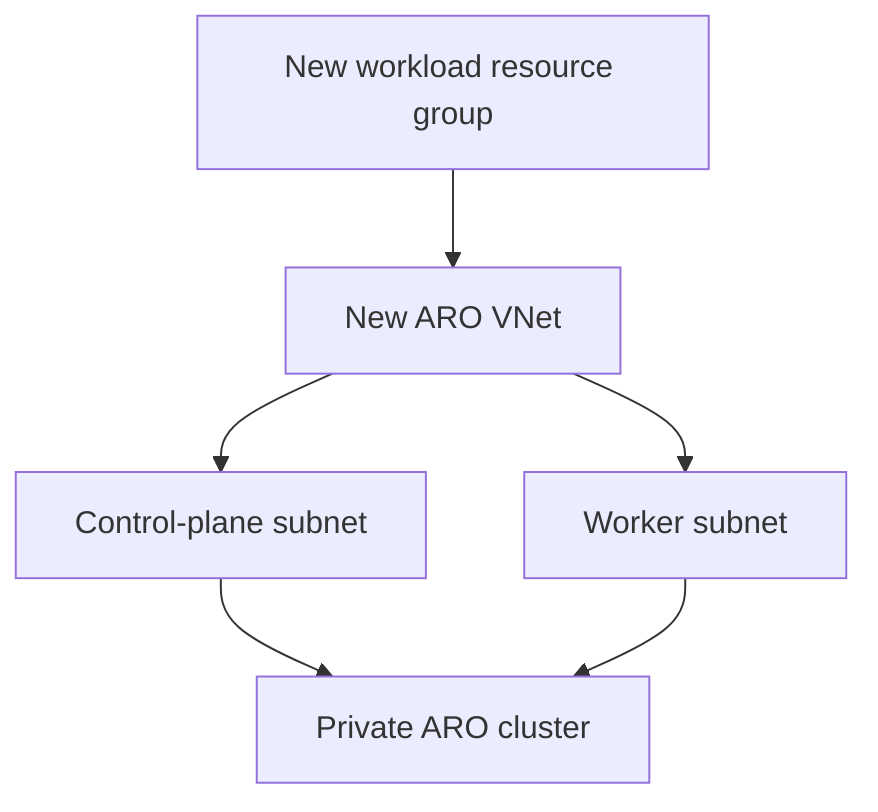
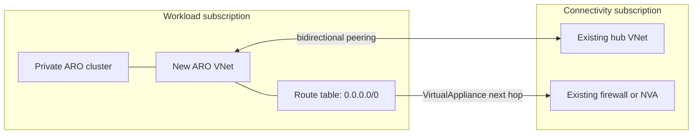

# Networking

Both deployment modes create the network boundary required for a new private ARO cluster. The difference is whether aroapplz also creates a connection from that new VNet to an existing hub.

## Owned in both modes

- A new ARO virtual network using `aro_vnet_cidr`
- A control-plane subnet using `control_plane_subnet_cidr`
- A worker subnet using `worker_subnet_cidr`
- A private ARO API profile
- A private ARO ingress profile

The workload also configures ARO pod and service CIDRs. Template defaults are `10.128.0.0/14` and `172.30.0.0/16`; ensure all relevant ranges are compatible with the wider network design.

## Standalone topology

No hub data lookup, peering, route table, or firewall/NVA resource is instantiated by the mode.

## Spoke topology

The workload creates:

- peering from the new ARO VNet to the existing hub;
- reverse peering from the existing hub to the new ARO VNet;
- a route table and default route targeting the supplied firewall/NVA private IP;
- route-table associations required by the workload template.

The workload does not create the hub, firewall, NVA, or their supporting platform resources.

## Platform integration checklist

Before `spoke` apply, confirm with network owners:

- ARO VNet, subnet, pod, and service CIDRs do not overlap connected networks.
- The hub permits the required peering and forwarded-traffic behavior.
- Return routes exist for the new ARO ranges.
- The next-hop IP belongs to a functioning virtual appliance path.
- DNS resolution works for Azure, ARO, and organizational dependencies.
- Firewall policy permits required ARO egress and operational access.
- Subscription and cross-subscription permissions allow reverse peering.

## Ingress and edge routing

Private ARO ingress does not make an application publicly reachable. The current `front_door` and `application_gateway` values are integration contracts only; operators must design, provision, and validate any edge service, origin connectivity, certificates, DNS, probes, and security policy.

## State storage connectivity

The generated workload state storage endpoint remains publicly reachable so GitHub-hosted runners can connect, but anonymous access and shared-key authentication are disabled. Microsoft Entra authorization is used. An organization that mandates private state endpoints must provide self-hosted runner connectivity and adapt the platform design.
